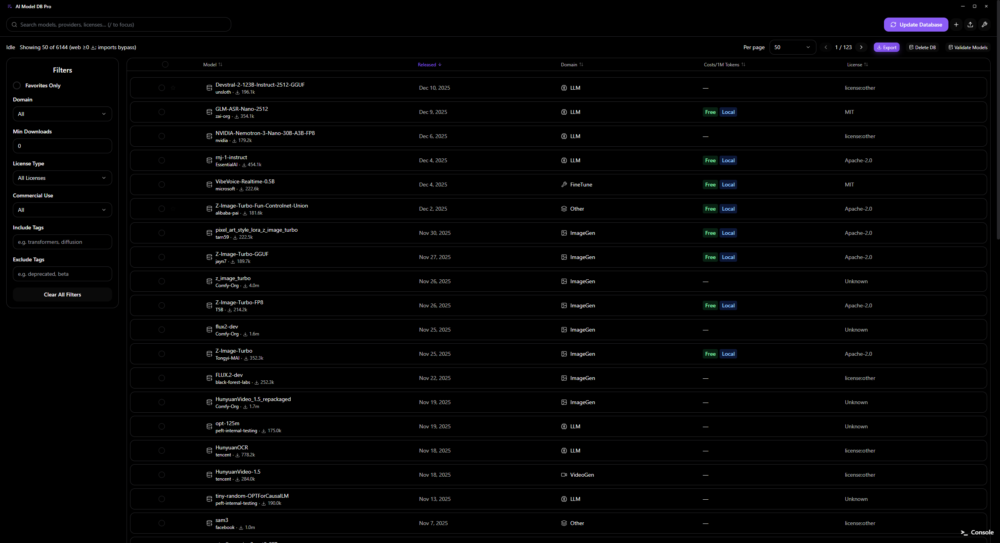
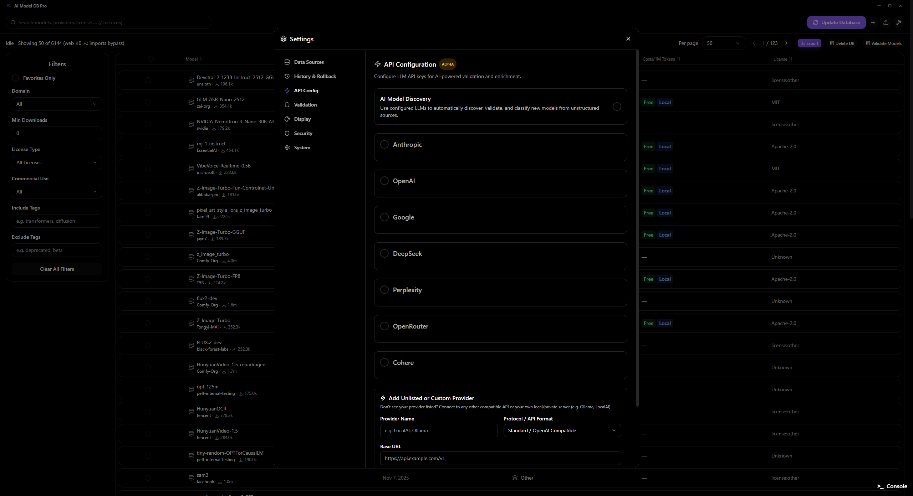
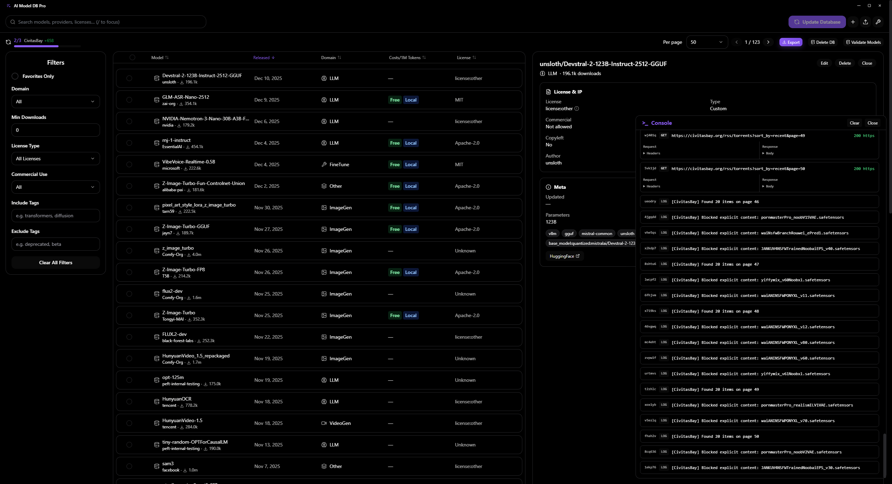

<p align="center">
  
</p>

<h1 align="center">AI Model DB</h1>

<p align="center">
  <strong>The ultimate desktop app for tracking, managing, and validating AI models</strong>
</p>

<p align="center">
  <a href="https://github.com/Jeremy8776/AIModelDB/releases/latest/download/AI-Model-DB-Setup.exe">
    
  </a>
  <a href="https://github.com/Jeremy8776/AIModelDB/releases/latest/download/AI-Model-DB.dmg">
    
  </a>
  <a href="https://github.com/Jeremy8776/AIModelDB/releases/latest/download/AI-Model-DB.AppImage">
    
  </a>
</p>

<p align="center">
  <a href="https://github.com/Jeremy8776/AIModelDB/blob/main/LICENSE">
    
  </a>
</p>

---

## Features

<table>
  <tr>
    <td width="50%">
      <h3>Multi-Source Database</h3>
      <p>Aggregate AI models from Hugging Face, Civitai, and more into one unified database.</p>
    </td>
    <td width="50%">
      <h3>LLM-Powered Validation</h3>
      <p>Use AI (OpenAI, Anthropic, Google, DeepSeek) to validate and enrich model metadata automatically.</p>
    </td>
  </tr>
  <tr>
    <td>
      <h3>Auto-Updates</h3>
      <p>Built-in update notifications with one-click download and install. Never miss a new version.</p>
    </td>
    <td>
      <h3>Advanced Filtering</h3>
      <p>Filter by domain (LLM, ImageGen, Audio, etc.), license type, commercial usage, tags, and more.</p>
    </td>
  </tr>
  <tr>
    <td>
      <h3>Beautiful UI</h3>
      <p>Sleek dark mode by default with customizable themes. Built for power users who care about aesthetics.</p>
    </td>
    <td>
      <h3>Secure Storage</h3>
      <p>All API keys are encrypted locally. Your credentials never leave your machine.</p>
    </td>
  </tr>
</table>

---

## Screenshots

<!-- Add your screenshots here -->
<p align="center">
  
  <br>
  <em>Main database view with model cards</em>
</p>

<p align="center">
  
  <br>
  <em>Settings panel with API configuration</em>
</p>

<p align="center">
  
  <br>
  <em>Real-time sync from multiple sources</em>
</p>

---

## Quick Start

### First Launch

1. **Download** the installer for your platform from the [Releases](https://github.com/Jeremy8776/AIModelDB/releases/latest) page
2. **Install** and launch AI Model DB
3. **Complete** the onboarding wizard to select data sources
4. **Configure** API keys (optional, for AI validation)
5. **Sync** to populate your database

### Data Sources

Enable any of these sources in Settings:
- **Hugging Face** - 10,000+ open-source models
- **Civitai** - Image generation models and LoRAs  
- **OpenModelDB** - Upscaler models
- **Artificial Analysis** - LLM benchmarks and pricing
- And more...

---

## NSFW Filtering Note

> **⚠️ Important**: While AI Model DB includes robust NSFW filtering (metadataregex + optional AI validation), **some NSFW models may still slip through** if their names and metadata contain no flagged keywords.
>
> If you require a **100% SFW environment** (e.g., for workplace use), we strongly recommend **disabling the CivitasBay/Civitai data source** in Settings, as this source contains the highest volume of unfiltered user-generated content.

---

## macOS Installation

> **Note**: When first opening the app on macOS, you may see an error saying **"AI Model DB is damaged and can't be opened"**. This is because the app is not signed with an Apple Developer certificate.

### Fix: Remove Quarantine Attribute

Open **Terminal** and run:

```bash
xattr -cr /Applications/AI\ Model\ DB.app
```

After running this command, you should be able to open the app normally.

### Alternative: Right-Click to Open

1. Right-click (or Control-click) on the app in Finder
2. Select **Open** from the context menu
3. Click **Open** in the dialog that appears

---

## Development

### Prerequisites

- Node.js 18+
- npm or yarn

### Setup

```bash
# Clone the repository
git clone https://github.com/Jeremy8776/AIModelDB.git
cd AIModelDB

# Install dependencies
npm install

# Run in development mode
npm run electron:dev
```

### Build Installers

```bash
# Windows
npm run electron:build:win

# macOS  
npm run electron:build:mac

# Linux
npm run electron:build:linux

# All platforms
npm run electron:build
```

---

## Tech Stack

| Technology | Purpose |
|------------|---------|
| Electron | Desktop application framework |
| React 18 | UI framework |
| TypeScript | Type safety |
| Vite | Build tool |
| TailwindCSS | Styling |
| electron-updater | Auto-updates |
| electron-builder | Installer creation |

---

## License

MIT License - See [LICENSE](LICENSE) for details.

---

## Disclaimer

**IMPORTANT: READ BEFORE USE**

This software is provided "as is", without warranty of any kind, express or implied. By using AI Model DB, you acknowledge and agree to the following:

### Data Sources and Terms of Service

AI Model DB is a **tool** that facilitates access to publicly available APIs and data sources. The software itself does not host, store, or redistribute any model data on behalf of users.

**Users are solely responsible for:**
- Reviewing and complying with the Terms of Service of each data source they choose to enable
- Ensuring their use of aggregated data complies with applicable laws and regulations
- Obtaining any necessary permissions or licenses for their intended use of the data
- Respecting rate limits and fair usage policies of third-party services

**The developers of AI Model DB:**
- Do not guarantee the accuracy, completeness, or availability of any third-party data
- Are not responsible for any changes to third-party APIs or Terms of Service
- Do not endorse or verify any models, content, or information retrieved through this software
- Accept no liability for any damages arising from the use or inability to use this software

### Third-Party Services

This software connects to third-party services including but not limited to Hugging Face, Civitai, OpenModelDB, and Artificial Analysis. These services are owned and operated by their respective companies and are subject to their own terms, privacy policies, and usage restrictions.

**Each data source may have different terms regarding:**
- Commercial vs. non-commercial use
- Data aggregation and redistribution
- API usage limits and authentication requirements
- Geographic restrictions

Users must independently verify compliance with each service's current terms before enabling data synchronization.

### No Legal Advice

Nothing in this software or documentation constitutes legal advice. If you have questions about the legality of your intended use, consult with a qualified legal professional.

### Indemnification

By using this software, you agree to indemnify and hold harmless the developers from any claims, damages, or expenses arising from your use of the software or violation of any third-party terms of service.

---

## Contributing

Contributions are welcome! Please read our contributing guidelines before submitting PRs.

---

<p align="center">
  Built with care for the AI community
  <br><br>
  <a href="https://github.com/Jeremy8776/AIModelDB/issues">Report Bug</a>
  ·
  <a href="https://github.com/Jeremy8776/AIModelDB/issues">Request Feature</a>
  ·
  <a href="https://github.com/Jeremy8776/AIModelDB/releases">Changelog</a>
</p>
